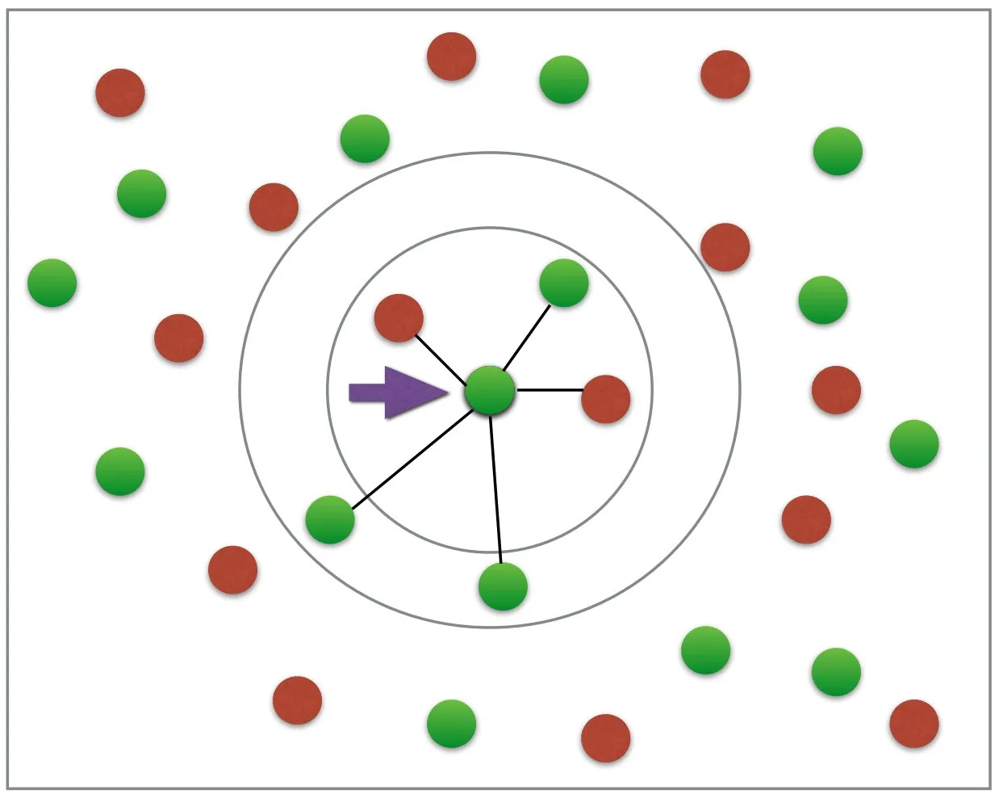

<!--# Final Year Project

This repository has been created to store your final year project.

You may edit it as you like, but please do not remove the default topics or the project members list. These need to stay as currently defined in order for your supervisor to be able to find your project. -->

# Comparison of Machine Learning Algorithms
__Nathan Kurien - zdac117 - CS3821 Final Project__

This repository contains my Final Year Project. Currently the project is undergoing the initial development phase, with proof-of-concept programs and early reports.

My project is to implement various multiple machine learning algorithms, such as KNN and Decision Trees, and compare their performance.

  
   

__The structure can be described as follows:__

### diary
This directory folder contains my project diary and personal notes as I work through my project this year.

### poc
This directory folder contains my proof of concept programs that will act as the foundation of my project development.
All development is in this folder.     
This folder includes the models, the datasets, the model tests and the jupyter notebooks for my project.

### reports
This directory folder contains the reports made or in progress, including my project plan and my interim report.

### research
This directory folder contains all material I've found useful with researching the theory and tools behind this project. I've kept useful resources here for my own reference.